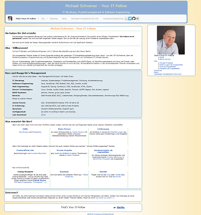

# MySimpleHomePage

MySimpleHomePage is a simple starter for your application.

For more information take a look at documentation:
- [portalinfo](docs/INFO.md)
- [changelog](docs/CHANGELOG.md) 
- [installation instructions](docs/INSTALL.md)
- [configuration instructions](docs/CONFIGURATION.md)
- [credits for used libraries](docs/CREDITS.md)

Best would be to generate and export static viewer-single-html after build with ``` bash -c "sbin/generateViewerFileForStaticData.sh F:/playground/myshp-test myshp"```

MySimpleHomePage bases on mytourbook-2.0.0.


